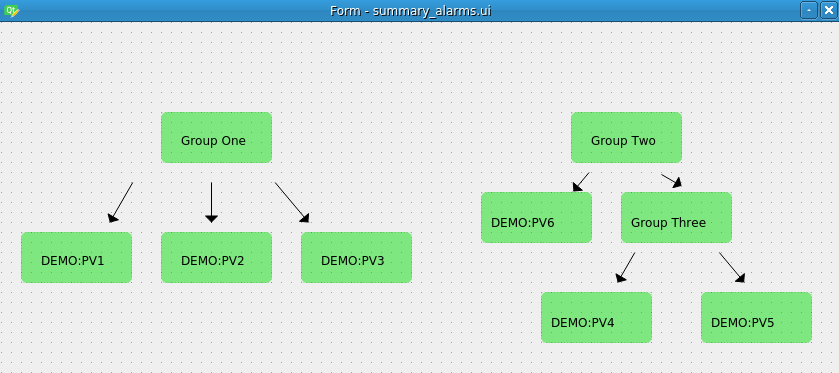
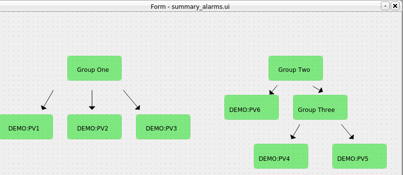
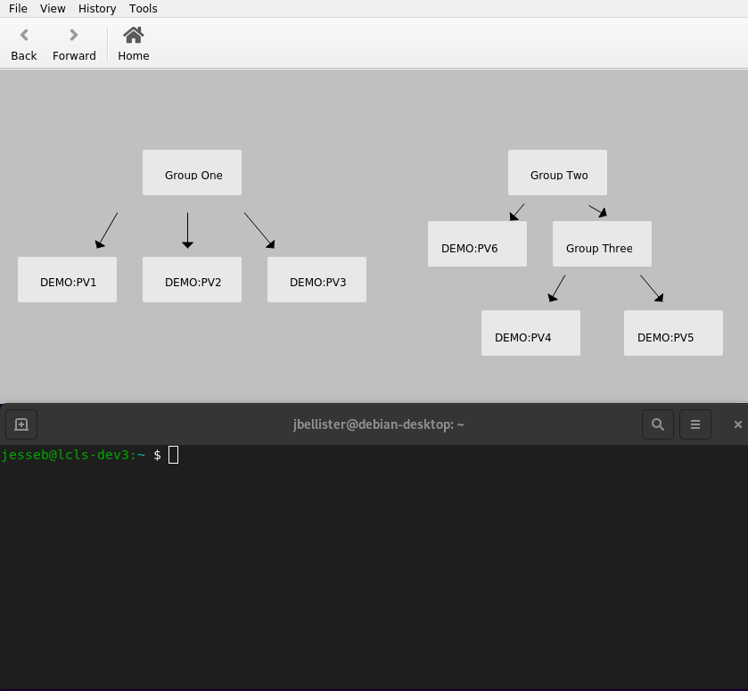

# PyDM Support

PyDM is a python based framework for building interfaces for control systems described in more detail [here](https://slaclab.github.io/pydm/).
PyDM is able to read in data from multiple sources via data plugins, allowing a standard way for UI widgets
to receive and display data.

One such data plugin is included with the slac-alarm-manager package. An associated [entrypoint](https://pypi.org/project/entrypoints/)
will cause PyDM to automatically discover this data plugin and allow the user to build displays that include
data from the alarm system.

## What Are Summary Alarms?

Since PyDM already includes built-in support for fetching and displaying the alarm status of individual PVs, the 
main benefit of this new plugin is for the display of summary alarms. A summary alarm is one which comprises a
number of underlying PVs or (other summary alarms). As an example, let's take an alarm hierarchy that looks like this:


Where the associated xml file describing the structure could look as follows:

```xml
<?xml version='1.0' encoding='utf8'?>
<config name="Demo">
    <component name="GROUP1">
        <pv name="DEMO:PV1">
            <enabled>true</enabled>
        </pv>
        <pv name="DEMO:PV2">
            <enabled>true</enabled>
        </pv>
        <pv name="DEMO:PV3">
            <enabled>true</enabled>
        </pv>
    </component>
    <component name="GROUP2">
        <component name="GROUP3">
            <pv name="DEMO:PV4">
                <enabled>true</enabled>
            </pv>
            <pv name="DEMO:PV5">
                <enabled>true</enabled>
            </pv>
        </component>
        <pv name="DEMO:PV6">
            <enabled>true</enabled>
        </pv>
        <pv name="DEMO:PV7">
            <enabled>true</enabled>
        </pv>
    </component>
</config>
```

Here `GROUP1` is a top level summary that will reflect the highest severity alarm from `DEMO:PV1`, `DEMO:PV2`, and `DEMO:PV3`.
`GROUP2` will do the same for its underlying components, one of which (`GROUP3`) is a summary alarm itself.
So if say `DEMO:PV2` goes into a minor alarm state, and `DEMO:PV3` into a major, then `GROUP1` will go into a major alarm
state as well. If `DEMO:PV3` returns to normal, then `GROUP1` will go into a minor alarm state as `DEMO:PV2` now has the
highest severity among its components.

We will create an example display based on this alarm hierarchy to show this and the PyDM/NALMS integration in action.

## Creating a Sample Display

To keep this display simple, we will just drop some PyDMFrame widgets onto it along with associated labels
identifying each summary alarm or PV being represented:



Next we'll connect each to a channel. The new `nalms://` protocol has been added as a way to communicate with the alarm
system. Using this protocol is required for the summary alarms as there is no actual IOC backing any of them. But as 
shown in this demo, using either regular channel access or `nalms://` is fine when dealing with individual PVs:




## Running the Display

To see the display working, first ensure that the following two environment variables are set to the correct value of the
alarm topic to monitor, as well as the location of the kafka cluster. For this demo:

```
export PYDM_KAFKA_ALARM_TOPIC=Demo
export PYDM_KAFKA_BOOTSTRAP_SERVERS=localhost:9092
```

Now with an instance of this display running, we can issue caput commands in order to toggle the PVs into various alarm
states. Here a minor alarm is represented by the darkened single border around a frame, and a major by the red double
border. You can see that the summary alarms will automatically take on the highest alarm state of any of its underlying
PVs as described above:



As a final note, the `nalms://` protocol should work with any widget which supports displaying alarm status, so more
complex displays than this can be created, for example with related display buttons to drill down into the components
of a system. And it is also possible to have the same PV as part of multiple summary alarms if needed.
